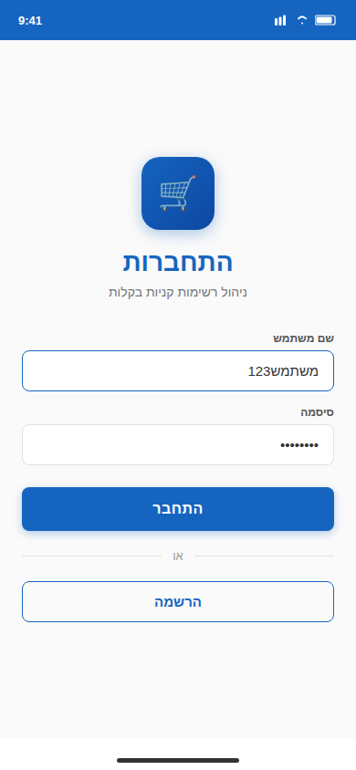
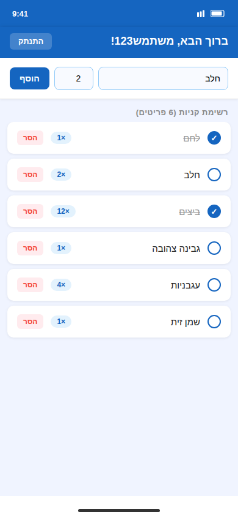
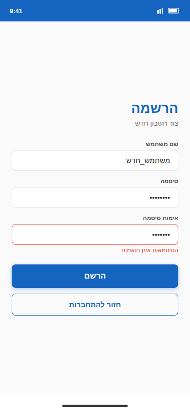

# Shopping Management App

[](https://opensource.org/licenses/MIT)

An Android shopping-list manager with user authentication. Users register and log in with a username and password, then manage a personal shopping list — adding products with quantities and removing them — with a Hebrew-language UI.

## Screenshots

| Login | Shopping List | Register |
|---|---|---|
|  |  |  |

## Features

- **User Registration** — Create a new account; credentials are persisted via `UserRepository`
- **Login** — Authenticate with existing credentials; navigate between Login and Register screens
- **Shopping List Management** — Add products by name and quantity; adding an existing product accumulates its quantity
- **Remove Items** — Delete individual products from the list with a single tap
- **Session Logout** — Clears the current user and shopping list and returns to the Login screen
- **Hebrew UI** — All labels and buttons are in Hebrew ("ברוך הבא", "הוסף", "הסר", "התנתק")

## Tech Stack

| Layer | Technology |
|---|---|
| Language | Kotlin |
| UI | Jetpack Compose (Material 3) |
| State management | `remember` / `mutableStateOf` |
| Data persistence | `UserRepository` (SharedPreferences-based) |
| Navigation | Composable state machine (`login` / `register` / `main`) |
| Build system | Gradle with Kotlin DSL + Version Catalog |
| Min SDK | 24 |
| Target / Compile SDK | 34 |
| AGP | 8.6.0 |
| Kotlin | 1.9.0 |

## Project Structure

```
ShoppingManagementApp/
├── app/
│   └── src/main/
│       ├── java/com/example/shoppingmanagementapp/
│       │   ├── MainActivity.kt              # Entry point; AppContent navigation host
│       │   ├── data/
│       │   │   └── UserRepository.kt        # User persistence layer
│       │   └── ui/
│       │       ├── screens/
│       │       │   ├── LoginScreen.kt       # Login form
│       │       │   ├── RegisterScreen.kt    # Registration form
│       │       │   └── MainScreen.kt        # Shopping list UI
│       │       └── theme/                   # Material 3 theme
│       └── AndroidManifest.xml
├── gradle/
│   ├── libs.versions.toml
│   └── wrapper/
└── settings.gradle.kts
```

## Screen Flow

```
LoginScreen  ──(success)──►  MainScreen  ──(logout)──►  LoginScreen
     │
 (register)
     ▼
RegisterScreen  ──(done)──►  LoginScreen
```

## How to Build

### Prerequisites

- Android Studio Hedgehog (2023.1.1) or newer
- Android SDK with API level 34 platform installed
- JDK 17+

### Steps

1. Clone the repository and open the `ShoppingManagementApp` folder in Android Studio.
2. Allow Gradle to sync and download all dependencies.
3. Connect a device or start an AVD (API 24+).
4. Click **Run > Run 'app'** or press `Shift+F10`.

### Command-line build

```bash
./gradlew assembleDebug
```

Output APK: `app/build/outputs/apk/debug/app-debug.apk`

---

## 🇮🇱 בעברית

אפליקציית Android לניהול רשימת קניות עם הרשמה והתחברות משתמשים. ממשק עברי, שמירה מקומית.
